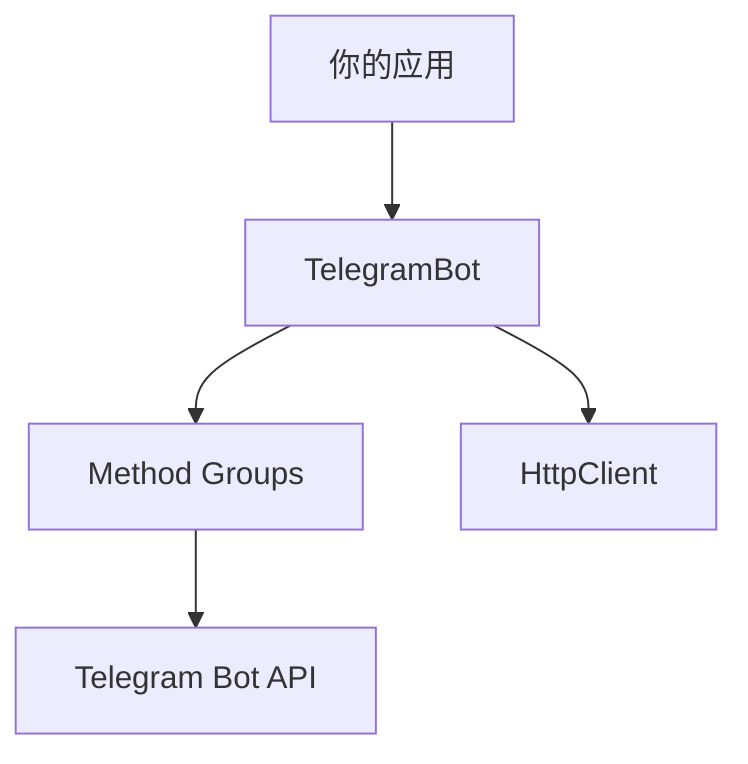

# 📋 API 参考

## 🏗️ 架构概览

## 📚 文档结构

### 🤖 核心类

| 类名 | 描述 | 文档链接 |
|------|------|----------|
| **TelegramBot** | 单个 Bot 实例 | [查看文档](telegram-bot.md) |

### 🔧 API 方法组

| 方法组 | 功能范围 | 文档链接 |
|--------|----------|----------|
| **MessageMethods** | 消息相关操作 | [查看文档](methods/message.md) |
| **ChatMethods** | 聊天管理操作 | [查看文档](methods/chat.md) |
| **UpdateMethods** | 更新和 Webhook | [查看文档](methods/update.md) |

### 📦 数据模型

| 模型 | 用途 | 文档链接 |
|------|------|----------|
| **Message** | 消息数据结构 | [查看文档](models/message.md) |
| **Chat** | 聊天数据结构 | [查看文档](models/chat.md) |
| **User** | 用户数据结构 | [查看文档](models/user.md) |
